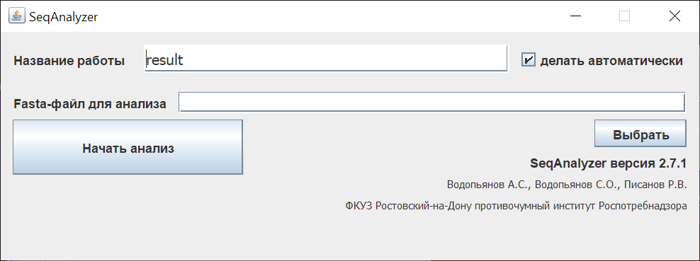
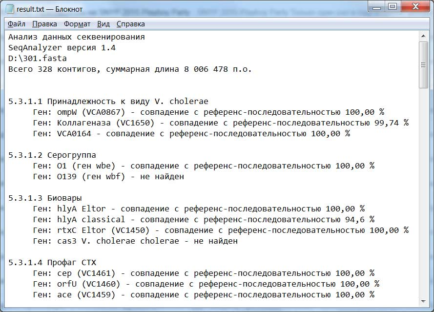

# SeqAnalyzer

**Программа для анализа результатов полногеномного секвенирования Vibrio cholerae**

## Содержание

* [Описание](#desc)
* [Основные возможности](#benefits)
* [Системные требования](#req)
* [Установка и запуск](#install)
* [Использование](#use)
* [Алгоритм работы](#algorithm)
* [Тестовые данные](#test)
* [Контакты и поддержка](#contacts)

## <a name="desc">Описание</a>

SeqAnalyzer — это специализированная программа, разработанная ФКУЗ «Ростовский-на-Дону противочумный институт» Роспотребнадзора для быстрого и эффективного анализа данных полногеномного секвенирования штаммов холерного вибриона. 

Программа позволяет определять ключевые характеристики штаммов V. cholerae путем поиска заранее определенных референсных генов среди набора контигов:
- **Видовую принадлежность**
- **Серогруппу**
- **Биовар**
- **Мобильные генетические элементы и островки**
- **Кратность вариабельных тандемных повторов (VNTR)**
- **Гены антибиотикорезистентности**



## <a name="benefits">Основные возможности</a>

### 🔬 Основные возможности
- Определение принадлежности к виду V. cholerae (гены ompW, коллагеназы, VCA0164)
- Идентификация серогрупп O1 (ген wbe) и O139 (ген wbf)
- Определение биовара через анализ генов гемолизина (hlyA), rtxC, cas3
- Выявление профагов CTX и RSI
- Поиск островков патогенности VPI-I и VPI-II
- Детекция островков пандемичности VSP-I и VSP-II
- Анализ систем секреции T3SS и T6SS типа

### 🧬 VNTR-анализ
- Автоматическое определение кратности вариабельных тандемных повторов
- Использование алгоритма "виртуальной ПЦР" с фланкирующими праймерами
- Высокое значение для эпидемиологического анализа

### 💊 Анализ антибиотикорезистентности
Выявление генов устойчивости к:
- Триметоприму
- Сульфаметоксазолу
- Хлорамфениколу (левомицетину)
- Стрептомицину
- Канамицину
- β-лактамным антибиотикам

### Отличительные особенности

✅ **Низкие системные требования** — работает на обычном компьютере с 1 ГБ ОЗУ  
✅ **Высокая скорость** — анализ генома (~10 МБ) за 3-4 минуты  
✅ **Простота использования** — принцип "одной кнопки", интуитивный интерфейс  
✅ **Работа с контигами** — не требует предварительной сборки генома  
✅ **Понятные результаты** — отчёт на русском языке в текстовом формате  
✅ **Независимость** — работает без подключения к зарубежным базам данных  

## <a name="req">Системные требования</a>

- **Операционная система**: Windows XP/7/8/10/11, Linux, Mac OS X
- **ОЗУ**: 1 ГБ
- **Дисковое пространство**: 50 МБ
- **Java**: JRE (для jar-версии)

## <a name="install">Установка и запуск</a>

### Полная версия (Windows, ~40 МБ)
Включает виртуальную машину Java:
```bash
# Распаковать архив
# Запустить SeqAnalyzer.bat
```

### Jar-версия (~1 МБ)
Требует предустановленной Java JRE:
```bash
java -jar SeqAnalyzer.jar
```

## <a name="use">Использование</a>

### Входные данные
- **Формат**: FASTA (.fasta, .fa)
- **Содержимое**: Набор контигов (результат сборки de novo коротких ридов)

### Процесс анализа
1. Запустите программу
2. Нажмите кнопку **"Выбрать"** для выбора FASTA-файла
3. При необходимости задайте **"Название работы"**
4. Нажмите **"Начать анализ"**
5. Дождитесь завершения (индикатор прогресса в нижней части окна)
6. Автоматически откроется текстовый файл с результатами

### Результаты
Программа генерирует текстовый отчёт, содержащий:
- Процент совпадения найденных генов с референсными последовательностями
- Информацию о принадлежности к виду, серогруппе, биовару
- Данные о мобильных генетических элементах
- Результаты VNTR-анализа
- Профиль антибиотикорезистентности



## <a name="algorithm">Алгоритм работы</a>

SeqAnalyzer использует **алгоритм локального выравнивания Смита-Ватермана** с аффинными штрафами за делеции и вставки для поиска референсных последовательностей среди контигов.

Для VNTR-анализа применяется алгоритм "виртуальной ПЦР":
```
Число повторов = (размер амплификата - размер фланкирующих участков) / кратность повтора
```

## <a name="test">Тестовые данные</a>

В комплекте с программой доступны тестовые файлы:
- **301.fasta** — штамм V. cholerae El Tor №301 (2011, Таганрогский залив)
- **18826.fasta** — штамм V. cholerae El Tor 18826 (2005, г. Тверь)
- **19187.fasta** — штамм V. cholerae El Tor 19187 (2010, г. Москва)

## Лицензия

Программа разработана ФКУЗ «Ростовский-на-Дону противочумный институт» Роспотребнадзора.

## <a name="contacts">Контакты и поддержка</a>

**Автор**: Водопьянов Алексей Сергеевич  
**Email**: alexvod@gmail.com  
**Телефон**: (863) 240-22-66  
**Адрес**: 344002, г. Ростов-на-Дону, ул. Максима Горького, 117

## Публикации

Если вы используете SeqAnalyzer в своих исследованиях, пожалуйста, ссылайтесь на методические рекомендации:

> Водопьянов А.С., Водопьянов С.О., Писанов Р.В., Олейников И.П., Кулешов К.В., Керманов А.В., Олейникова К.В. Анализ результатов полногеномного секвенирования Vibrio cholerae и определения кратности вариабельных тандемных повторов (VNTR) с помощью программы SeqAnalyzer. Методические рекомендации. Ростов-на-Дону, 2014.

## Дополнительные ресурсы

- [Официальная страница на сайте института](https://antiplague.ru/scientific-activity/publication/seqanalyzer-programma-dlya-analiza-rezultatov-polnogenomnogo-sekvenirovaniya-vibrio-cholerae/)
- [Методические рекомендации](https://antiplague.ru/seqanalyzer)

---

*Программа предназначена для врачей, биологов, специалистов по молекулярной биологии, проводящих анализ данных полногеномного секвенирования штаммов холерного вибриона.*

